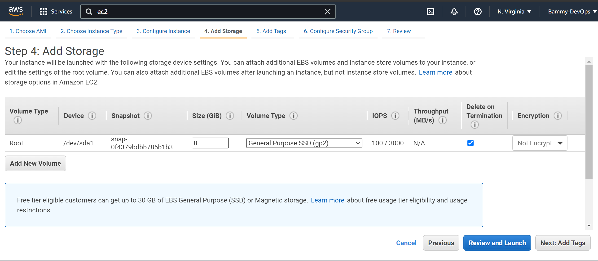

####  Step One - Spin up a AWS instance - This is the virtual hardware on which LAMP would be implemented.
1. **Login into your AWS** 
2. **Lunch your Ec2 instance type.**

3. **One instance is good enough and selected**

4. **Use the default settings.**

5. **Configure Security Group, generate a key pair and lunch.**

6. **ssh into aws from windows terminal.**

