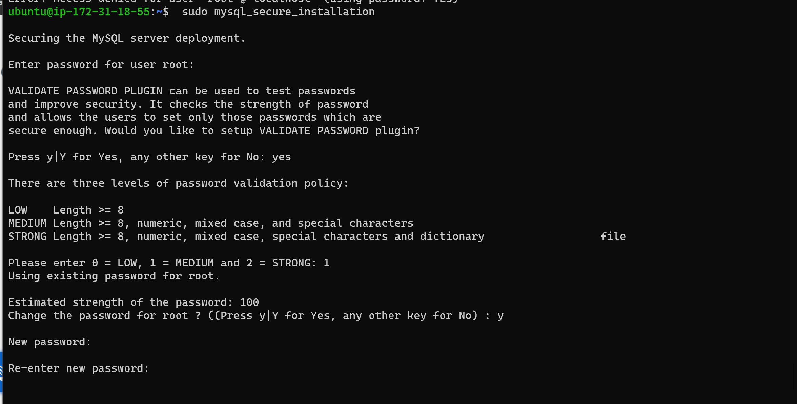
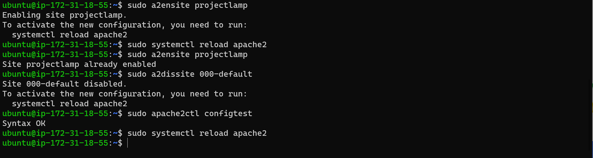

####  Step One - Spin up a AWS instance - This is the virtual hardware on which LAMP would be implemented.
1. **Login into your AWS** 
2. **Lunch your Ec2 instance type.**

3. **One instance is good enough and selected**

4. **Use the default settings.**

5. **Configure Security Group, generate a key pair and lunch.**

6. **ssh into aws from windows terminal.**

####  Step Two - Installing Apache and updating the firewall
1. **Use the apt command - update all packages and install apache2 package** 

`sudo apt update`

`sudo apt install apache2`

2. **Verify Apache2 service is running.**

`sudo systemctl status apache2`

2. **Now access the installed apache2 server locally .**

` curl http://127.0.0.1:80`

3. **Confirm the Apache2 server is accesiable in the browser. - Make sure the security group allows both tcp and ssh remote connection**

` http://52.73.55.62:80` - in the browser or 

`curl -s http://52.73.55.62:80` - via the remote connection

####  Step Three - Time to install the MySql database  on the Apache server.
1. ** install MySql Server package** 

`sudo apt install mysql-server`

2. **Log into the install MySql console.**

`sudo mysql`

2. **Aasign a password *PassWord.1* to Admin User ROOT and exit.**

`ALTER USER 'root'@'localhost' IDENTIFIED WITH mysql_native_password BY 'PassWord.1';`

 

2. **Start an interactive script. - The process allows default logins and database to be removed for better security**

`sudo mysql_secure_installation`

 

####  Step Four - Time to install Php.
1. **Three PHP packages would be require** 
- Php package
- php-mysql package - communication with MySql
- libapache2-mod-php - php communication with Apache2 server

`sudo apt install php php-mysql libapache2-mod-php`

####  All LAMP Components are now up and runnning.

 #### **Step Five -** Test the setup - Configure a Apache Virtual Host to host our web application which would serve client computers.

 1. Create a domain "projectlamp" under the /www directory and assign ownership to your currect system user

`sudo mkdir /var/www/projectlamp`

`sudo chown -R $USER:$USER /var/www/projectlamp`

 

  2. Create a configure file in Apaches's sites-available directory

`sudo vi /etc/apache2/sites-available/projectlamp.conf`

 

 3. Show the new projectlamp.conf file

`sudo ls /etc/apache2/sites-available`

 
 4. Enable the new virtual host, 

- `sudo a2ensite projectlamp`
- Disable default Apache's default website

- `sudo a2dissite 000-default`

- Finally, reload Apache

- `sudo apache2ctl configtest`

 

5. The new directory is empty - Let's create an index.html file
- Make sure to change the ip to your external IP

`sudo echo 'Hello LAMP from hostname' $(curl -s "52.87.225.72"/latest/meta-data/public-hostname) 'with public IP' $(curl -s http://52.87.225.72/latest/meta-data/public-ipv4) > /var/www/projectlamp/index.html`

5. Now let's view our website in the browser
- View with Public Ip
- `http://52.87.225.72:80`

- view with Public DNS
