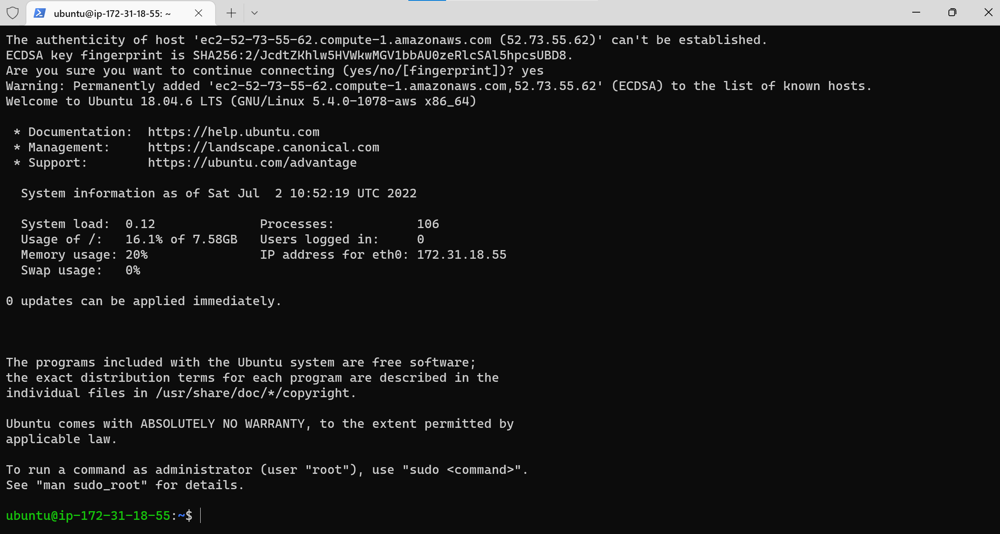

####  Step One - Spin up a AWS instance - This is the virtual hardware on which LAMP would be implemented.
1. **Login into your AWS** 
2. **Lunch your Ec2 instance type.**

3. **One instance is good enough and selected**

4. **Use the default settings.**

5. **Configure Security Group, generate a key pair and lunch.**

6. **ssh into aws from windows terminal.**

####  Step Two - Installing Apache and updating the firewall
1. **Use the apt command - update all packages and install apache2 package** 

`sudo apt update`

`sudo apt install apache2`

2. **Verify Apache2 service is running.**

`sudo systemctl status apache2`

2. **Now access the installed apache2 server locally .**

` curl http://127.0.0.1:80`

3. **Confirm the Apache2 server is accesiable in the browser. - Make sure the security group allows but tcp and ssh remote connection**

` http://52.73.55.62:80` - in the browser or 

`curl -s http://52.73.55.62:80` - via the remote connection

####  Step Three - Time to install the MySql database  on the Apache server.
1. **Use the apt command - update all packages and install apache2 package** 

`sudo apt install mysql-server`

2. **Log into the install MqSql console.**

`sudo mysql`

